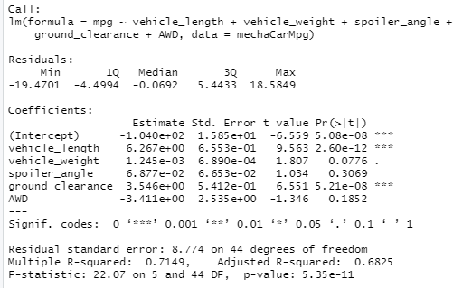
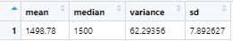
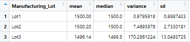
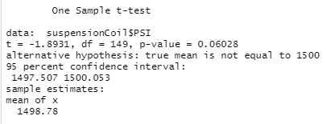
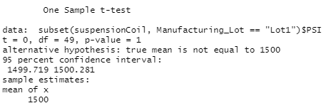
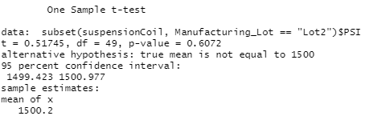
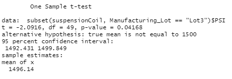

# MechaCar Statistical Analysis
## Overview of Analysis

### In this analysis we wi

## Linear Regression to Predict MPG

### Looking at the linear regression model and summary for the MechaCars dataset there are several things we can tell several things...

 - The variables/coefficients that provided a non-random amount of variance and signifigant impact on mpg were "Vehicle Length" and "Ground Clearance".
 - Looking at the p-values for the signifigant variables we can see that they are both below the signifigance level of .05. This means that the slope of the linear model is not zero and we can reject our null hypothesis.
 - By looking at the R-squared value we can see that 71% of the variability of mpg is explained by the model. This means that the model can effectively predict the mpg of the car prototypes.

## Summary Statistics on Suspension Coils

### We also Looked at a dataset of results from production lots of the MechaCar's suspension coils. We know that the design specifications for the MechaCar dictate the variance of the suspension coils can't exceed 100lbs per square inch. Looking at the Total Summary below we can see that the variance is only 62.29. This is below the threshold so it would appear they meet the design specification. However when we break the data down by lot we see only two of three lots actually meet the requirement; Lot1's variance is only .97; Lot2 has a variance of 7.47 and Lot3's variance is well above 100 at 170.29
### Total Summary

### Lot Summary

## T-Tests on Suspension Coils

### In order to test if the mean of a sample of the data is representative of the mean of the entire population we can use a t-test. The population mean for MechaCar suspension coils is 1500. Below are the results of t-tests of all three lots together as well as each lot individually.

 - **Total**: The sample mean of all three lots together equals 1498 and has a p-value of .06. Assuming the signifigance level is .05, we can see that the value of this sample is higher. This means we do not have the evidence to reject the null hypothesis and that the sample is statistically similar to the population. 

 - **Lot1**: The sample mean of all Lot1 equals 1500 and has a p-value of 1. Assuming the signifigance level is .05, we can see that the value of this sample is higher. This means we do not have the evidence to reject the null hypothesis and a p-value of 1 means the sample mean exactly matched the population mean. 

 - **Lot2**: The sample mean of Lot2 equals 1500.2 and has a p-value of .6. Assuming the signifigance level is .05, we can see that the value of this sample is higher. This means we do not have the evidence to reject the null hypothesis and that the sample is statistically similar to the population.

 - **Lot3**: The sample mean of Lot3 equals 1496.14 and has a p-value of .04. Assuming the signifigance level is .05, we can see that the value of this sample is lower. This means we accept the null hypothesis and that the sample mean is statistically different than the population.
 

## Study Design: MechaCar vs Competition

### We should also be comparing MechaCar to it's competition to see where it stands and why consumers should choose MechaCar over that competition. Consumers like to feel like they are getting a deal. If we can show that MechaCar performs better in some ways then other more expensive cars it might be a good way to reach more consumers. People also care about their safety, we could start with the null hypothesis that MechaCar is cheaper than cars of a similar, or the same, safety rating. we would need additional data to run the test. Mainly we would need safety rating data on the competition and their prices; it may be possible to find an api we can retrieve vehicle safety ratings and prices from. Once we have the price and safety data we can do a t-test to determine if the price for the MechaCar is statistically similar to vehicles of the same safety rating. Comparing the resulting means and p-values would tell us if we could accept the null hypothesis.
